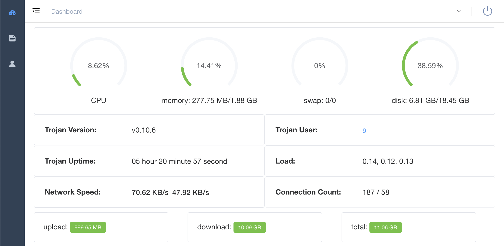
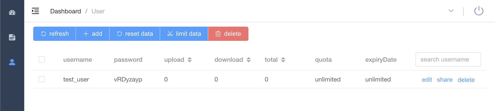

# trojan
 

[](https://goreportcard.com/report/github.com/Jrohy/trojan)
[](https://img.shields.io/github/downloads/Jrohy/trojan/total.svg)
[](https://www.gnu.org/licenses/gpl-3.0.en.html)


trojan多用户管理部署程序

## Features
-The way to manage Trojan multi -user on online web page and command lines
-Beoph / stop / restart the Trojan server
-Chide statistics and traffic restrictions
-Plord line mode management, support command complement
-In Integrated ACME.SH Certificate Application
-On the client configuration file
-Chat online real -time Trojan log
-Trojan and Trojan-GO switch at any time
-Chising Trojan: // Share links and QR code sharing (only web page)
-Cap to be converted to Clash subscription address and import to [CLASH_FOR_WINDOWS] (https://github.com/fndroid/clash_FOR_WINDOWS_PKG/releases) (only web page)
-The duration of user usage

## installation method
*Trojan, please prepare the domain name available to the server in advance*

###  a. 一Key to install
```
#Installation/update
source <(curl -sL https://git.io/trojan-install)

#Uninstall
source <(curl -sL https://git.io/trojan-install) --remove

```
Enter the 'Trojan' to enter the management program after installation
Browser access https: // Domain name can be available online web page to manage Trojan user
Front page source code address: [train-web] (https://github.com/jrohy/trojan-web)

### b. docker run
1. Install mysql  

Because MariaDB memory is at least half lower than mysql, it is recommended to use the MariaDB database
```
docker run --name trojan-mariadb --restart=always -p 3306:3306 -v /home/mariadb:/var/lib/mysql -e MYSQL_ROOT_PASSWORD=trojan -e MYSQL_ROOT_HOST=% -e MYSQL_DATABASE=trojan -d mariadb:10.2
```
Both ports and root passwords and persistence directory can be changed to other
2. Install Trojan
```
docker run -it -d --name trojan --net=host --restart=always --privileged jrohy/trojan init
```
After running, enter the container `docker exec -it trojan bash`, Then enter 'trjan' to initialize the installation

Start a web service: `systemctl start trojan-web`   

Set self-activation: `systemctl enable trojan-web`

Update management program: `source <(curl -sL https://git.io/trojan-install)`

## Run a screenshot



## Command Line
```
Usage:
  trojan [flags]
  trojan [command]

Available Commands:
  add           Add user
  clean         Clear designated user traffic
  completion    Automatically command to make up (support BASH and ZSH)
  del           delete users
  help          Help about any command
  info          User information list
  log           View trojan log
  port          Modify the trojan port
  restart       Restart trojan
  start         Start up trojan
  status        View trojan status
  stop          Stop trojan
  tls           Certificate installation
  update        Update trojan
  updateWeb     Update trojan management GUI
  version       Display version number
  import [path] Import SQL file
  export [path] Export sql file
  web           Start up with web 

Flags:
  -h, --help   help for trojan
```

## Notice
After installing Trojan, it is strongly recommended to open BBR and other acceleration: [Linux-NetSpeed](https://github.com/chiakge/Linux-NetSpeed)  
